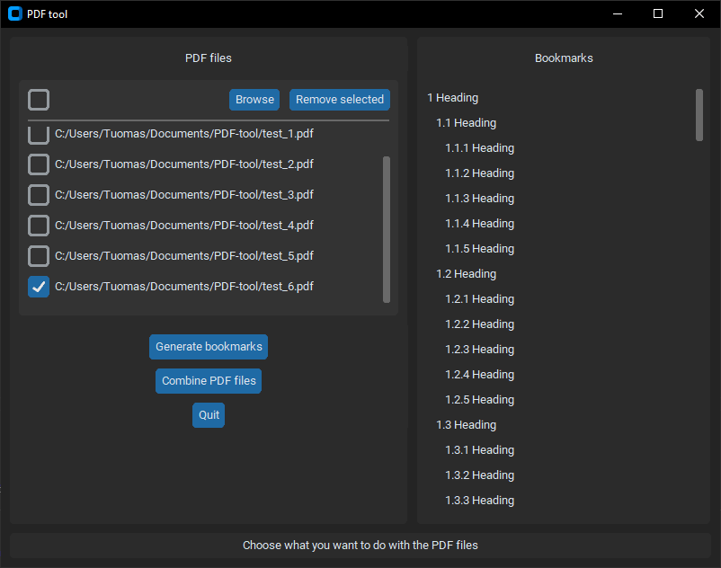

# PDF-tool
Tool for modifying PDFs in different ways.



## Features
- Automatically create bookmarks for a PDF
- Create bookmarks for multiple PDF files at a time
- Combine PDF files
- View bookmarks of a PDF
- Simple GUI

## Installation
- Install Python 3
- Install requirements:
```
pip install -r requirements.txt
```

## Usage
```
py main.py
```

## Upcoming features
- Editing bookmarks in the GUI
- Edit PDF's metadata

## Changelog
15.4.2023: New bookmarks are automatically shown in the GUI after generating them

25.3.2023: Bookmarks of a PDF can be viewed in the app

19.3.2023: Combining PDF files

18.3.2023: Simple GUI for the app, adding bookmarks to multiple PDF files a time

15.3.2023: Adding bookmarks can be cancelled if the PDF already has them

15.3.2023: Can add bookmarks to a PDF file

15.3.2023: Initialized repository
